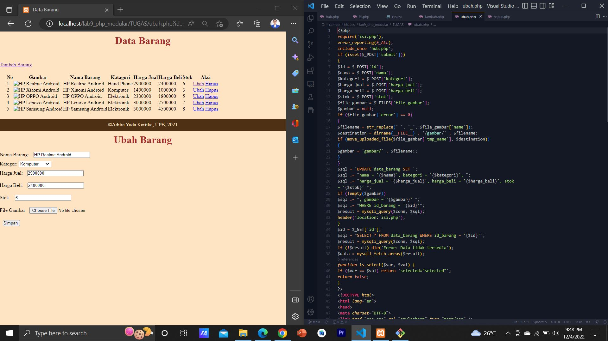

# Lab9web
# Praktikum 9 
# PHP Modular

# Tugas
## Implementasikan Konsep Modularisasi pada kode Program PRAKTIKUM 8

* BERIKUT ADALAH HASILNYA
* =====
     * Data Barang
     * 
* =====
     * Tambah barang
     * 
* =====
     * Ubah Barang
     * 